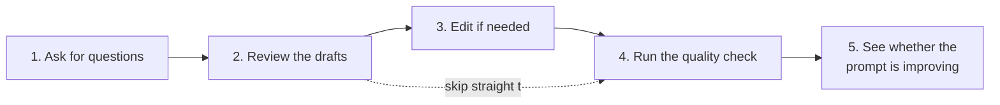
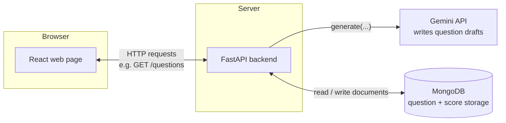
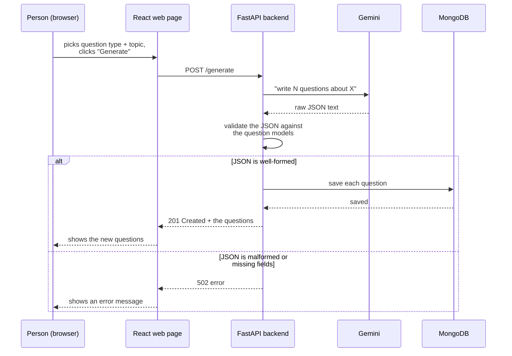
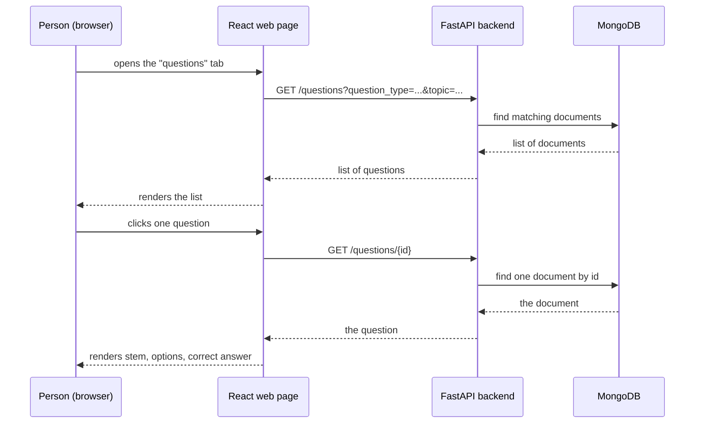
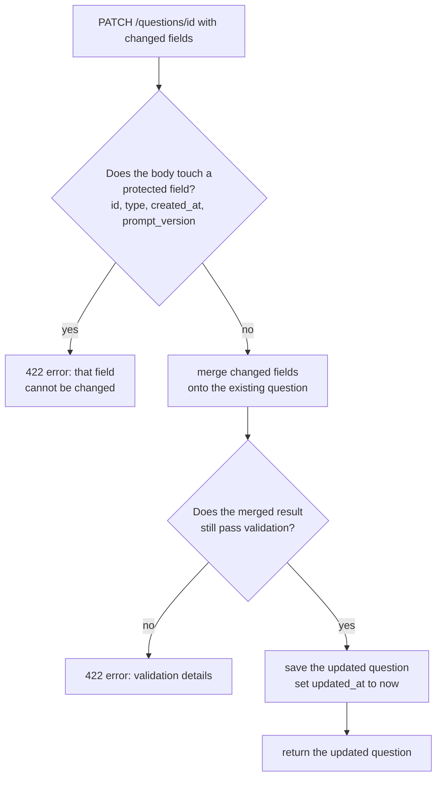
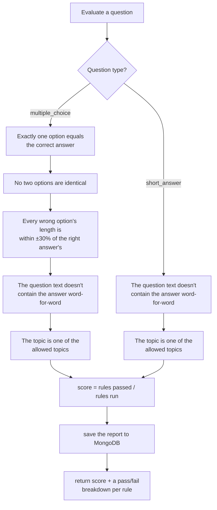
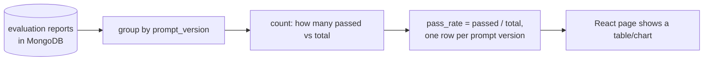
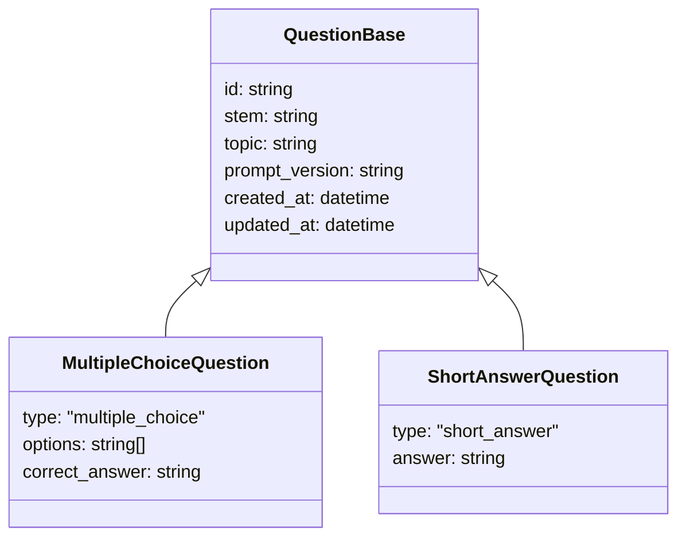
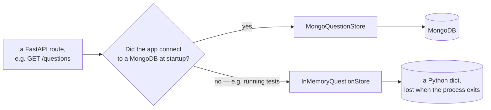
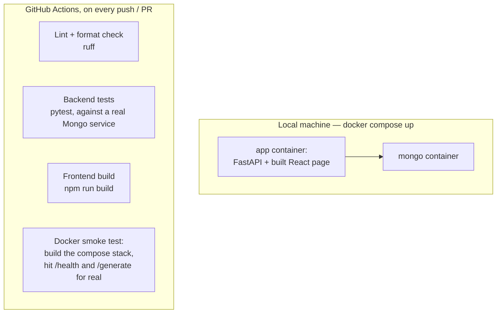

# How question-bench works

This document explains the whole app from the outside in, using diagrams
instead of prose wherever a diagram is clearer. It assumes no prior
knowledge of Python, MongoDB, or this codebase — just an interest in how
the pieces fit together.

## What the app is for

question-bench helps someone write test questions quickly, then checks
their quality automatically instead of by eye. A person asks for a batch
of questions on a topic, an AI model (Gemini) drafts them, and a set of
fixed rules — not a second AI opinion — scores each one: does it have
exactly one right answer, are the wrong answers a fair length, that kind
of thing.

Each of these five steps is one HTTP endpoint, covered in its own section
below.

## The big picture

Three programs talk to each other: a web page running in the browser, a
backend server, and a database. The backend also calls out to Google's
Gemini service to write the questions.

- **The web page** is what a person actually looks at: forms to request
  questions, a list to browse them, buttons to edit and evaluate.
- **The backend** is the only thing that talks to the database or to
  Gemini. The web page never does either directly — it only ever calls
  the backend.
- **MongoDB** stores every question and every evaluation score as a
  document (think: a JSON object saved to disk), rather than as rows in a
  spreadsheet-like table. That fits this app because a multiple-choice
  question and a short-answer question have different shapes, and a
  document database doesn't force them into one shared table.

## Endpoint 1 — asking for questions (`POST /generate`)

The validation step matters: an AI model can return text that *looks*
like the right shape but isn't quite (a missing field, an extra one, the
wrong type). The backend never trusts that text — it always tries to
parse it into a strict question model first, and refuses to save
anything that doesn't fit.

There's also a **stub generator** that produces fake-but-valid questions
instantly, with no network call and no API key. It exists so the rest of
the app (and its automated tests) can be built and run without ever
hitting Gemini — the backend picks Gemini or the stub automatically
depending on whether an API key is configured.

## Endpoint 2 & 3 — browsing questions (`GET /questions`, `GET /questions/{id}`)

Filtering by type or topic happens in the database query, not by
fetching everything and filtering in the backend — that's the difference
between asking the database "give me only the arithmetic ones" and
asking for everything and throwing away what you don't want.

## Endpoint 4 — editing a question (`PATCH /questions/{id}`)

A `PATCH` request sends only the fields that changed, not the whole
question. The backend fills in the rest from what's already saved.

Some fields are locked because changing them wouldn't make sense after
the fact: you can't turn a multiple-choice question into a short-answer
one via edit, and you can't rewrite history by changing when it was
created or which prompt produced it.

## Endpoint 5 — running the quality check (`POST /questions/{id}/evaluate`)

This is the core idea of the whole project: a **fixed, deterministic**
set of rules, written in plain code, not a second AI model guessing
whether a question is good. The rules that run depend on the question's
type.

A "wrong option" in a multiple-choice question is called a
**distractor**. The length rule exists because a distractor that's much
shorter or longer than the real answer is a giveaway — a test-taker can
often spot the right answer just by its length, without knowing the
subject at all.

Every report is saved with the `prompt_version` string that was stamped
on the question when it was generated. That's what makes step 5 possible.

## Endpoint 6 — is the prompt getting better? (`GET /stats/pass-rate`)

If the generation prompt is edited and re-tagged with a new
`prompt_version`, its questions get evaluated and land in this same
table under the new version. Comparing pass rates across versions is
literally comparing two rows.

## The data model

A question is one of exactly two shapes, and every question — regardless
of shape — shares a set of common fields.

The `type` field is what tells the backend which of the two shapes a
given piece of data is. When something arrives — from the database, from
Gemini, from a `PATCH` request — the backend looks at `type` first, then
checks the rest of the fields against the matching shape. Anything
without a recognisable `type`, or with fields that don't belong to that
shape, is rejected outright rather than silently accepted in a broken
form. That rejection-by-default is deliberate: better to fail loudly
than to save a malformed question.

## Two interchangeable places to store data

The backend can run against a real MongoDB, or — for automated tests —
against a plain in-memory dictionary. Both offer exactly the same set of
operations (`add`, `get`, `list`, `replace`, `add_report`, ...), so
nothing else in the app needs to know or care which one is actually in
use.

This is why the automated test suite doesn't need a real database
running: tests get the in-memory store, save and read questions against
it, and everything behaves the same as it would against MongoDB — just
without persisting anything past the test run.

## Running it locally and in CI

The smoke test is the one check that exercises the *whole* stack exactly
as a user would run it — build the containers, wait for the app to
report healthy, generate a couple of questions over HTTP, and confirm
they come back from `GET /questions`. Lint, format, and unit tests catch
problems earlier and faster; the smoke test catches anything that only
shows up when everything is wired together for real.

## Glossary

- **Document / document database** — a self-contained record (like a
  JSON object) stored as one unit, rather than as a row split across
  linked tables. MongoDB stores questions and evaluation reports this
  way, which is convenient here because the two question types have
  genuinely different shapes.
- **Pydantic model** — a Python class that both describes a shape of
  data and checks incoming data against that shape, rejecting anything
  that doesn't fit. `MultipleChoiceQuestion` and `ShortAnswerQuestion`
  are Pydantic models.
- **Validation** — the act of checking that some data matches an
  expected shape (right fields, right types, nothing extra) before
  trusting it.
- **Discriminator field** — a field (here, `type`) whose value tells the
  system which of several possible shapes a piece of data is, before it
  tries to validate the rest.
- **Stub / fake implementation** — a simplified stand-in for something
  real (here, a question generator that doesn't call Gemini at all) used
  so the rest of the system can be built and tested without depending on
  it.
- **Distractor** — in a multiple-choice question, one of the wrong
  answer options.
- **Prompt version** — a label attached to every generated question
  identifying which version of the generation instructions produced it,
  so quality scores can be compared across prompt changes.
- **Endpoint** — one specific URL + HTTP method combination that the
  backend responds to, e.g. `POST /generate`.
- **CI (continuous integration)** — automated checks (lint, tests, a
  build, a smoke test) that run on every proposed change before it's
  allowed to merge.
