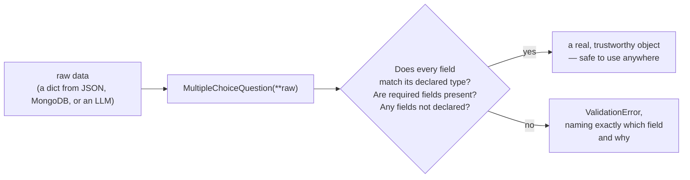
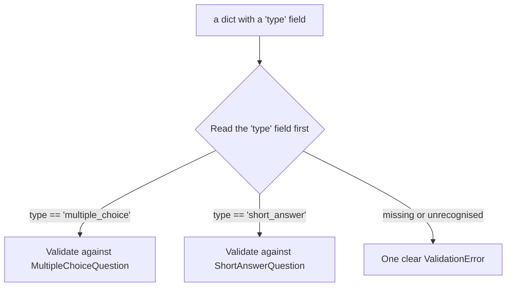
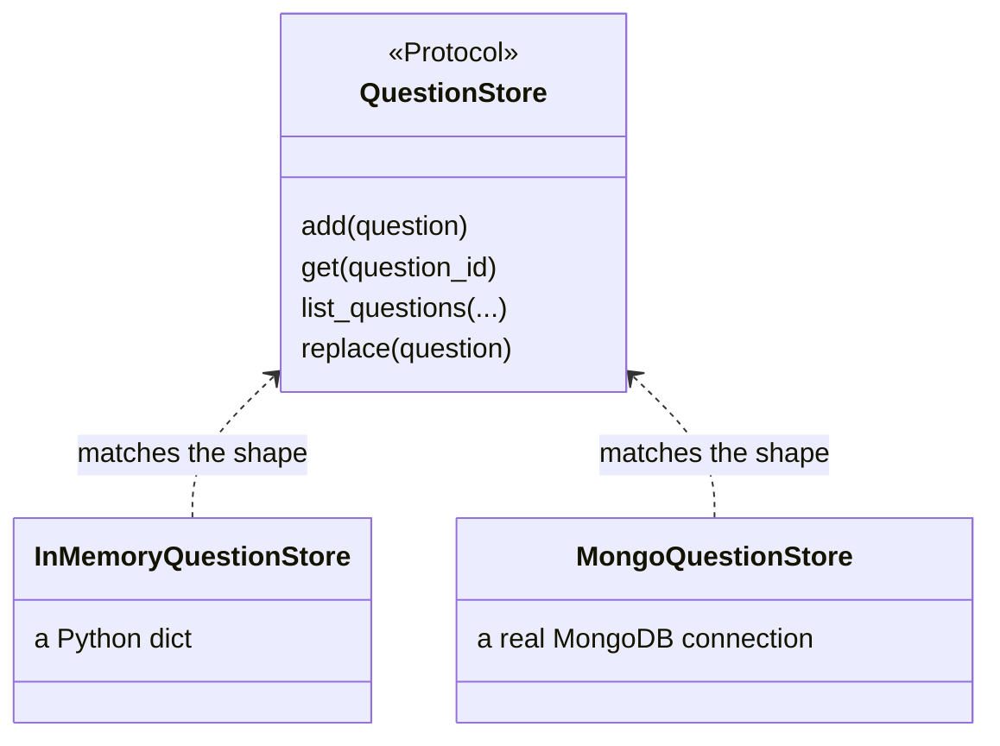
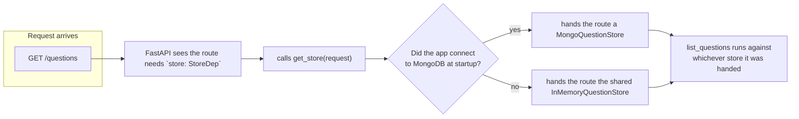
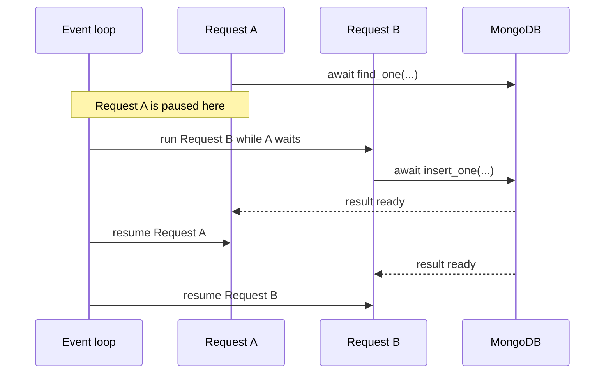
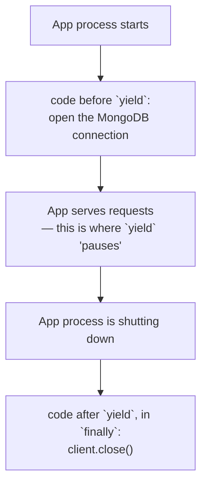
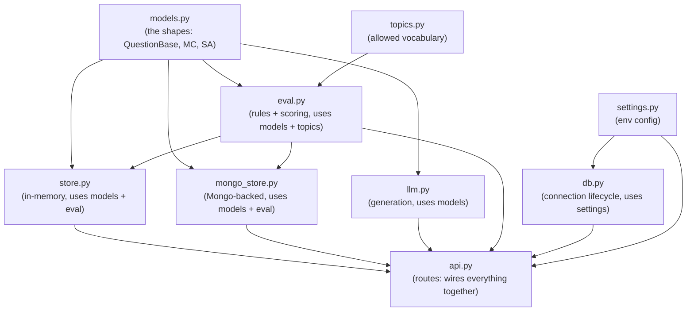

# How Python works in this app

This document is for someone who hasn't written Python before but has
built backends in another language. It doesn't re-explain the app itself
— see [`architecture.md`](./architecture.md) for that — it explains the
*patterns* the Python code uses, why each one is there, and where to see
it in this repo. Every pattern here is general-purpose: none of it is
specific to this project, so recognising it should make other Python
backends (and the equivalent idea in other languages) easier to read.

## 1. Type hints describe shape, but don't enforce it by themselves

```python
def evaluate(question: Question) -> EvaluationReport:
```

`question: Question` and `-> EvaluationReport` are **type hints**: they
tell a human (and a type-checker) what's expected, but Python itself
doesn't stop you calling `evaluate("hello")` at runtime — nothing crashes
until the code tries to use `"hello"` like a `Question` and fails. Type
hints are documentation with tooling support, not a wall. That's why the
next pattern exists.

*See it in:* every function signature in `src/question_bench/`.

## 2. Pydantic models — where "shape" actually gets enforced

A **Pydantic model** is a class that both describes a shape of data and
*checks* incoming data against that shape at the moment it's constructed.
This is where real enforcement happens, not at the type-hint level.



```python
class QuestionBase(BaseModel):
    model_config = ConfigDict(extra="forbid")
    id: str = Field(default_factory=lambda: uuid.uuid4().hex)
    stem: str = Field(min_length=1)
    topic: str = Field(min_length=1)
```

`extra="forbid"` is a deliberate choice, not the default: it means an
unexpected field is treated as an error rather than silently dropped.
That matters here because the data crossing this boundary comes from an
LLM, which can drift from the schema it was asked for.

`default_factory=lambda: uuid.uuid4().hex` — a field's default can be a
*function to call* rather than a fixed value. This matters because a
fixed default (`id: str = uuid.uuid4().hex`) would compute one UUID
**once**, when the class is defined, and hand every instance the same
id. `default_factory` calls the function fresh for each new object.

*See it in:* `src/question_bench/models.py`, `src/question_bench/eval.py`
(`EvaluationReport`, `PromptVersionStats`).

## 3. The discriminated union — one field decides which shape applies

Two question shapes exist (`MultipleChoiceQuestion`, `ShortAnswerQuestion`),
and incoming data needs to be routed to the right one automatically.

```python
Question = Annotated[
    MultipleChoiceQuestion | ShortAnswerQuestion,
    Field(discriminator="type"),
]
QuestionAdapter = TypeAdapter(Question)
```



`MultipleChoiceQuestion | ShortAnswerQuestion` is Python's union type
syntax — "this value is one of these types." `Field(discriminator="type")`
is what makes the union *routable*: instead of trying each shape in turn
and hoping one fits, Pydantic reads `type` first and validates against
only the matching model.

`TypeAdapter` exists because a bare union has no `.model_validate()`
method of its own — only a real class does. `TypeAdapter(Question)` wraps
the union so it can be validated like one. Every place raw data enters
the system (a Mongo document, an LLM response, a `PATCH` body) goes
through `QuestionAdapter.validate_python(...)`.

*See it in:* `src/question_bench/models.py:58-66`.

## 4. Protocols — an interface without inheritance

Two very different classes both need to act as "a place to store
questions": `InMemoryQuestionStore` (a Python dict) and
`MongoQuestionStore` (a real database). Neither inherits from the other,
or from anything.



```python
class QuestionStore(Protocol):
    async def add(self, question: Question) -> Question: ...
    async def get(self, question_id: str) -> Question | None: ...
```

A `Protocol` describes a set of methods a class must have — but a class
never declares "I implement `QuestionStore`." It just happens to have
methods with matching names and signatures, and that's enough. This is
**structural typing**: what matters is the shape a class actually has,
not a declared family tree. The rest of the app (routes, tests) can be
written against `QuestionStore` and never know or care which concrete
class is underneath — see pattern 6, dependency injection, for how that
swap actually happens at runtime.

*See it in:* `src/question_bench/store.py`, `src/question_bench/llm.py`
(`QuestionGenerator` is the same pattern, for `StubQuestionGenerator` vs.
`GeminiQuestionGenerator`).

## 5. Decorators — wrapping a function without changing its body

A decorator is a function that takes another function and hands back a
(usually wrapped) replacement. The `@something` syntax above a function
is just a shorthand for that.

```python
@app.get("/questions/{question_id}", response_model=Question)
async def get_question(question_id: str, store: StoreDep) -> Question: ...
```

`@app.get(...)` doesn't change what `get_question` does when you call it
directly — it registers the function with FastAPI's router, so an
incoming `GET /questions/{id}` request gets routed here. The function
itself stays a plain, testable function; the decorator is what wires it
into the web framework.

```python
@lru_cache
def _gemini_generator(api_key: str) -> QuestionGenerator: ...
```

`@lru_cache` is a general-purpose decorator from Python's standard
library: it remembers a function's past return values by their
arguments, so a second call with the same `api_key` returns the cached
generator instead of constructing a new one.

*See it in:* every route in `src/question_bench/api.py`;
`@lru_cache` in `api.py` and `settings.py`;
`@dataclass(frozen=True, slots=True)` in `eval.py`, which generates
`__init__`, equality, and (because of `frozen=True`) a `__setattr__`
that raises if you try to mutate an instance after creation.

## 6. Dependency injection — routes ask for what they need, don't build it

A route function declares the things it needs as parameters; something
outside the function decides what to actually hand it.



```python
StoreDep = Annotated[QuestionStore, Depends(get_store)]

@app.get("/questions", response_model=list[Question])
async def list_questions(store: StoreDep, ...) -> list[Question]:
    return await store.list_questions(...)
```

`list_questions` never calls `get_store()` itself, never imports
`MongoQuestionStore`, and never checks whether Mongo is connected. It
just declares "give me something shaped like a `QuestionStore`" via the
`StoreDep` annotation, and FastAPI resolves that at request time by
calling `get_store`. This is **dependency injection**: the route
receives its dependency from the outside instead of constructing it
itself, so the two can vary independently.

This is exactly what makes pattern 8 (testing) possible: tests replace
`get_store` entirely, and every route that depends on `StoreDep`
automatically gets the replacement without any of the route code
changing.

*See it in:* `src/question_bench/api.py:38-67` (`get_store`,
`get_generator`, `get_settings`, and the three `*Dep` aliases).

## 7. `async`/`await` — one program, many in-flight operations

```python
async def get(self, question_id: str) -> Question | None:
    doc = await self._questions.find_one({"_id": question_id})
    return _from_doc(doc) if doc is not None else None
```

`async def` marks a function as one that can *pause* mid-execution
without blocking the whole program. `await` is the pause point: "start
this operation (here, a database query over the network), and let other
work happen while we wait for it to finish." Without `async`/`await`, a
single slow database call would freeze the entire server for every user
until it returned.



`InMemoryQuestionStore`'s methods are also declared `async`, even though
a dict lookup never actually waits on anything — that's deliberate. It
lets the store swap for `MongoQuestionStore` (which genuinely needs to
await network calls) without changing a single line of caller code; both
satisfy the same `QuestionStore` Protocol from pattern 4.

*See it in:* `src/question_bench/store.py`,
`src/question_bench/mongo_store.py`, every route in `api.py`.

## 8. Context managers — guaranteed setup and teardown

```python
@asynccontextmanager
async def lifespan(app: FastAPI) -> AsyncIterator[None]:
    client = AsyncIOMotorClient(settings.mongo_url, tz_aware=True)
    app.state.mongo_client = client
    app.state.mongo_db = client[settings.mongo_db]
    await ensure_indexes(app.state.mongo_db)
    try:
        yield
    finally:
        client.close()
```



A **context manager** guarantees that cleanup code runs, even if
something goes wrong while the app is running. `yield` is the dividing
line: everything before it is setup, everything after it (in the
`finally` block) is teardown, and FastAPI runs the setup half once at
startup and the teardown half once at shutdown, no matter what happens
in between.

*See it in:* `src/question_bench/db.py`.

## 9. Settings from the environment, not hardcoded

```python
class Settings(BaseSettings):
    model_config = SettingsConfigDict(env_file=".env", extra="ignore")
    gemini_api_key: str = ""
    mongo_url: str = "mongodb://localhost:27017"


@lru_cache
def get_settings() -> Settings:
    return Settings()
```

`BaseSettings` is a Pydantic model whose fields are automatically filled
from environment variables (or a `.env` file) instead of being passed in
by hand — `mongo_url` here comes from the `MONGO_URL` environment
variable if one is set, and falls back to the class default otherwise.
`@lru_cache` on `get_settings` means the environment is only read once
per process; every caller after the first gets the same cached `Settings`
object back.

*See it in:* `src/question_bench/settings.py`.

## 10. Tests: fixtures, and swapping dependencies for real ones

```python
@pytest.fixture
def valid_mc() -> MultipleChoiceQuestion:
    return MultipleChoiceQuestion(stem="...", topic="arithmetic", ...)
```

A **fixture** is a function pytest calls on your behalf before a test
runs, then hands the result to any test that names it as a parameter.
`valid_mc` builds one known-good question; every test that takes
`valid_mc: MultipleChoiceQuestion` as an argument gets a fresh one,
without repeating the construction code.

```python
@pytest.fixture
def client() -> Iterator[TestClient]:
    store = InMemoryQuestionStore()
    app.dependency_overrides[get_store] = lambda: store
    app.dependency_overrides[get_generator] = StubQuestionGenerator
    yield TestClient(app)
    app.dependency_overrides.clear()
```

This is pattern 6 (dependency injection) paying off directly: because
every route asks for `StoreDep`/`GeneratorDep` rather than constructing
a store or generator itself, a test can swap in a disposable in-memory
store and a deterministic fake generator for the *entire app*, with zero
changes to route code. `app.dependency_overrides` is a dict FastAPI
checks before calling the real dependency function — if an override is
registered, it's used instead. `yield` here works like pattern 8: the
line before `yield` is setup (register the overrides), the line after is
teardown (clear them so the next test starts clean).

*See it in:* `tests/conftest.py`, `tests/test_api.py`.

## How the pieces depend on each other

None of the modules import each other randomly — data flows in one
direction, from raw input down to a validated shape everything else can
trust.



`api.py` sits at the top: it's the only file that knows about every
other piece and wires them together via dependency injection (pattern
6). `models.py` sits at the bottom: it depends on nothing else in this
project, because every other module needs to agree on what a "question"
*is* before it can do anything with one.

## Glossary

- **Type hint** — an annotation (`x: int`) that documents expected shape;
  checked by tools, not enforced by Python itself at runtime.
- **Pydantic model** — a class that validates data against a declared
  shape the moment an instance is constructed, raising a clear error if
  it doesn't fit.
- **Discriminated union** — a value that's one of several possible
  shapes, with one field (the discriminator) naming which shape applies.
- **Protocol / structural typing** — an interface satisfied by having
  the right methods, not by declaring inheritance from anything.
- **Decorator** — a function that wraps another function, used here to
  register routes (`@app.get`) and to cache results (`@lru_cache`).
- **Dependency injection** — a function receives what it needs as a
  parameter from an external resolver, rather than constructing it
  itself, so the dependency can be swapped without touching the function.
- **`async` / `await`** — marks a function as pausable, and marks the
  point where it pauses to wait on a slow operation, so other work can
  run in the meantime.
- **Context manager** — a block with guaranteed setup and teardown code,
  split by a `yield`, e.g. "open a connection, ... , always close it."
- **Fixture** — a function pytest runs before a test to build something
  the test needs, injected as a parameter with the fixture's name.
- **Frozenset** — an immutable set; used for `ALLOWED_TOPICS` so the
  vocabulary can't be mutated by accident after it's defined.
